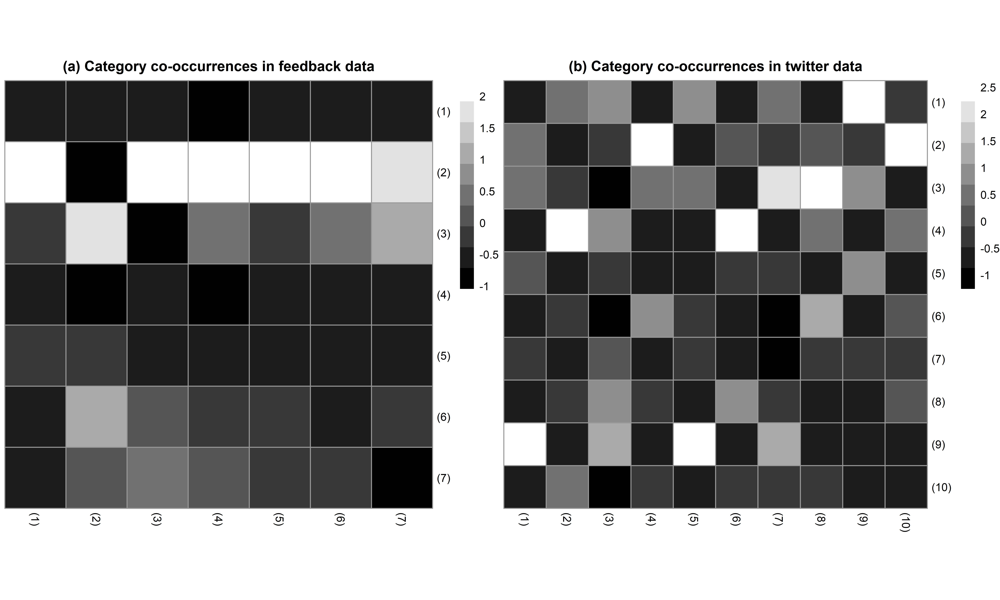

  
  
  
  

 **Text mining individual states in short texts** 
    
 
*Preprint available [here](https://osf.io/preprints/socarxiv/cerzs/).*

{width=450px, height=450px}\

Sociologists have successfully used text mining to investigate discourse using news articles, official documents, and other sources. Yet, the potential of exploring millions of short texts generated spontaneously by individuals in online environments has remained untapped within the field. To fill this gap, we show how such texts can inform sociologists about individual internal states such as norms, motives, and stances, which thus far have been mainly elicited using surveys. We assess the performance of 581 variations of three text mining approaches–dictionary methods, supervised, and unsupervised machine learning–against the benchmark of texts coded by humans for complex schemes capturing individuals’ internal states. Our analysis includes coding feedback texts from an online market for motives for leaving feedback (N = 2,000) and tweet texts for moral values expressed in text (N = 3,832). We describe challenges arising with these different approaches and provide best-practice advice for future applications.

--------------
